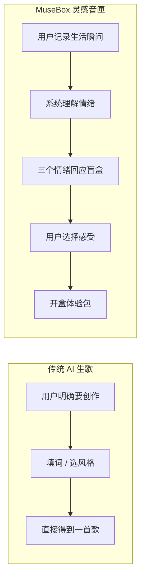
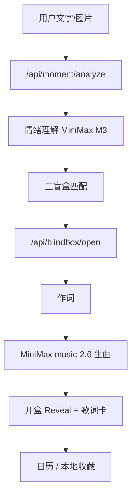

# MuseBox 灵感音匣 — 产品方案

> 把生活瞬间，变成可以听见的音乐盲盒。

## 1. 产品定位

**MuseBox 灵感音匣** 是 MuseBox 产品集的首款旗舰产品：一款以「瞬间 × 盲盒 × AI 音乐」为核心的 Web 体验。

用户不需要明确「要创作什么歌」，只需记录今天的一个瞬间（文字 / 图片 / 文字+图片），系统理解情绪后呈现三个「情绪回应盲盒」，用户选择最贴合当下感受的一个，开盒获得完整体验包：**开盒文案 + AI 专属歌曲 + 视觉歌词卡**。

> **一句话**：不是「我要做歌」，而是「今天这一瞬间，哪一句更像我」。

## 2. 我们要解决什么问题

当前 AI 生成音乐普遍存在**互动性与娱乐性不足**的问题，用户留存受限。

| 指标 | 变化 | 含义 |
|------|------|------|
| AI 音乐搜索分 | **+114.7%** | 用户对 AI 音乐仍有强烈探索意愿 |
| AI 音乐内容分 | **-13%** | 现有体验难以持续激发兴趣，亟需升级 |

| 用户痛点 | 传统 AI 生歌 | MuseBox 解法 |
|----------|-------------|--------------|
| 有情绪，但不知道要什么歌 | 需明确创作意图与 prompt | 把「创作决策」变成「感受选择」 |
| 生成结果缺乏仪式感 | 列表式输出、听完即走 | 盲盒机制 + 开盒 Reveal |
| 单次生成不可控、难共情 | 一键出歌、缺少参与感 | 三策略并行，用户自选最懂的那一句 |
| 难以沉淀与复访 | 无个人记忆载体 | 音乐日历、音匣手记、歌词卡收藏 |

## 3. 目标用户与产品机会

MuseBox 以 **「AI 生成音乐 + 盲盒互动」** 切入年轻用户市场：

- **18—30 岁人群**：AI 音乐 TGI 指数低于平均值 100，传统「搜歌 / 生曲」难以打动该群体
- **同年龄段盲盒 TGI 指数远高于 100**，将盲盒机制引入 AI 音乐具备较强产品潜力

产品闭环：**生成 → 记录 → 分享 → 复访**。

## 4. 与「纯 AI 生歌工具」的差异化

- **生歌工具**：创作导向（Tool）
- **灵感音匣**：体验导向（Experience）
- **核心差异**：从「我要做歌」到「今天这一瞬间，哪一句更像我」

## 5. 用户流程

### Step 1 · 写+拍

- **文字**：一句自然语言，不限情绪词
- **图片**：随手拍 / 相册 + 可选补充说明
- **文字+图片**：推荐组合，降低 AI 误判

### Step 2 · 抽

- 提交瞬间后进入抽盒页，系统分析图文并生成 3 个盲盒
- 内部策略：**同频 / 转场 / 偶遇**（前台以文案与气质呈现，不强加策略术语）
- 用户选择最符合当下感受的一个

### Step 3 · 看+听

- 开盒动画与 Reveal
- **AI 实时作词 + 生曲**（MiniMax）
- **视觉歌词卡** + 播放器（歌词滚动同步）
- 后续：**收藏到日历** / **保存歌词卡** / **音匣手记**

### 辅助入口

- **`/demo`**：预置场景，便于快速体验完整流程
- **日历页**：按月浏览收藏、播放、手记与分享

## 6. 三策略引擎

| 策略 | 音乐意图 | 文案气质示例 |
|------|---------|-------------|
| **同频** | 停留在当前情绪，不强行治愈 | 雨没有停，但心里亮了一小块。 |
| **转场** | 同主题，情绪轻轻转向 | 有些好心情，不需要晴天证明。 |
| **偶遇** | 意外曲风，但语义仍相关 | 城市湿漉漉的，你刚好冒着热气。 |

每个盲盒对应不同音色层、节拍气质与匹配分数，生曲 prompt 与作词均围绕用户瞬间与所选策略展开。

## 7. 核心功能模块

| 模块 | 说明 |
|------|------|
| 瞬间输入 | 文字、图片、说明；本地压缩与氛围边框 |
| 情绪理解 | MiniMax M3 多模态分析 + 规则引擎 fallback |
| 盲盒生成 | 三策略文案、歌名、曲库匹配 / AI 生曲 |
| 开盒生曲 | 作词（LLM + fallback）→ MiniMax music-2.6 生曲 |
| 歌词卡 | DOM / Canvas 导出；有图专辑卡布局 |
| 音乐日历 | 本地收藏、缩略图、播放、手记、分享 |
| 异步开盒 | `OPEN_ASYNC=1` 适配云托管 60s 网关；可回退同步模式 |

## 8. 技术架构（当前实现）

- **前端**：Next.js 15 App Router · PWA（`apps/web`）
- **AI**：MiniMax M3（图文 / 文案）+ music-2.6（实时生曲）
- **部署**：Vercel（长连接）或 Docker 云托管（`OPEN_ASYNC=1` + 轮询）
- **曲库**：`content/songs.json` 作为 demo / fallback（`MUSIC_MODE=auto|library`）

## 9. 商业与产品集延伸

1. **日常留存**：从「偶尔生歌」到「每天记录瞬间」
2. **社交传播**：歌词卡保存与分享，开盒结果可传播
3. **主题盲盒**：节日 / 城市 / 品牌联名场景包
4. **会员增值**：高级策略、更多开盒次数、高清导出
5. **产品集第二款**：在同一「瞬间资产」上延伸（如瞬间志深化、互玩盲盒等）

## 10. 产品指标（建议跟踪）

| 指标 | 说明 |
|------|------|
| 瞬间提交率 | 首页 → 进入抽盒 |
| 开盒完成率 | 选盒 → 听到音乐 |
| 收藏率 | 开盒 → 收藏到日历 |
| 分享率 | 保存 / 分享歌词卡 |
| 7 日回访 | 日历或再次记录瞬间 |

## 11. 已知体验边界（产品层）

- AI 生曲需等待 1～4 分钟，需做好等待叙事与阶段反馈
- 日历收藏依赖浏览器本地存储，换设备不自动同步
- 生曲成本与 API 配额需在产品层考虑次数或会员策略

---

相关文档：[README.md](../README.md) · 部署说明见 `apps/web/.env.example`
