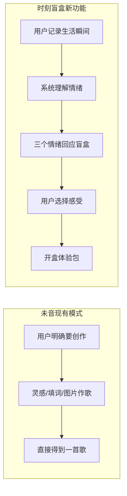
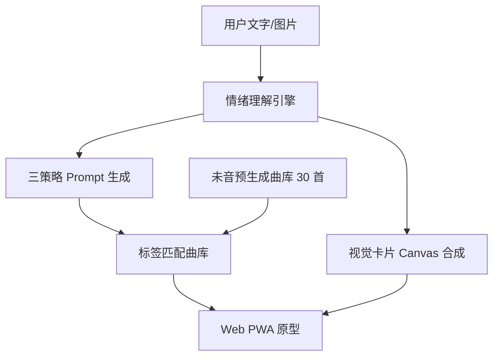

# 未音·时刻音乐盲盒 — 产品方案

## 1. 产品定位

**未音·时刻音乐盲盒** 是嵌入腾讯音乐「未音 VEMUS」平台的情绪消费型功能模块。用户不需要明确「要创作什么歌」，只需记录今天的一个瞬间（文字 / 图片 / 文字+图片），系统即生成三个「情绪回应盲盒」，用户选择最贴合当下感受的一个，开盒获得完整体验包：**开盒文案 + AI 歌曲 + 专属视觉卡片**。

> **答辩一句话**：未音教会了每个人创作音乐；时刻盲盒教会了音乐来回应每个人。

## 2. 痛点与机会

| 痛点 | 未音现有能力 | 盲盒解决方案 |
|------|------------|------------|
| 用户有情绪，但不知道要什么歌 | 灵感/填词/图片作歌需明确创作意图 | 把「创作决策」变成「感受选择」 |
| 纯推荐列表缺乏仪式感 | 社区瀑布流、榜单 | 盲盒机制 + 开盒 reveal |
| 图片作歌结果不可控 | 单次生成 | 三策略并行，用户自选最懂的那一句 |
| 听完即走，无沉淀 | 发布/点赞 | 情绪音乐日历，形成个人情绪档案 |

## 3. 与未音的差异化

- **未音现有**：创作工具（Tool）
- **时刻盲盒**：情绪产品（Experience）
- **核心差异**：从「我要做歌」到「今天这一瞬间，哪一句更像我」

## 4. 用户流程

### Step 1 · 写+拍
- 文字：一句自然语言，不限情绪词
- 图片：随手拍 / 相册 + 可选补充说明
- 文字+图片：推荐默认态，降低 AI 误判

### Step 2 · 抽
- 上滑/点击「抽取」
- 系统生成 3 个盲盒（内部策略：同频 / 转场 / 偶遇，前台不可见）
- 前台仅展示三句情绪文案，用户选择最符合当下感受的一个

### Step 3 · 看+听
- 开盒文案（2 句，不剧透歌名）
- AI 歌曲（开盒后才 reveal 歌名/音乐人）
- 专属视觉卡片
- 后续：收藏到情绪日历 / 保存分享 / 查看歌曲故事

## 5. 三策略引擎

| 策略 | 音乐意图 | 前台文案示例 |
|------|---------|------------|
| **同频** | 停留在当前情绪，不强行治愈 | 雨没有停，但心里亮了一小块。 |
| **转场** | 同主题，情绪轻轻转向 | 有些好心情，不需要晴天证明。 |
| **偶遇** | 意外曲风，但语义仍相关 | 城市湿漉漉的，你刚好冒着热气。 |

## 6. 技术架构（比赛 Demo）

- **Demo 阶段**：未音预生成曲库 + 标签余弦匹配（未音无公开 API）
- **正式版**：内嵌未音生成能力，作为 App 新 Tab「时刻盲盒」

## 7. 商业想象

1. **未音 DAU 提升**：从「想创作时才打开」到「每天记录瞬间」
2. **社区内容**：开盒后可一键「用此灵感二创」，衔接未音二创接龙
3. **发行转化**：高共鸣盲盒歌曲可引导「一键发行到 QQ 音乐」
4. **品牌合作**：节日/城市/品牌主题盲盒（如「毕业季盲盒」「深夜便利店盲盒」）
5. **会员增值**：高级策略（如「重逢」「告别」「庆祝」）作为会员权益

## 8. 比赛对齐

| 评审维度 | 方案体现 |
|---------|---------|
| 技术驾驭力 | 多模态理解 + 三策略引擎 + 视觉卡片生成 |
| 音乐表现力 | 30 首未音 demo 曲库，三策略听感差异明显 |
| 叙事艺术性 | 日常瞬间 → 情绪回应 → 开盒惊喜 完整叙事链 |

## 9. 未音嵌入设计

在未音 App 底部 Tab 新增「时刻」：
- 首页：今日瞬间输入
- 次级入口：情绪音乐日历
- 与现有「灵感作歌」「社区」形成互补，不替代创作流

## 10. 代表投稿曲建议

选 **「末班地铁」**（sync-late-night-01）作为比赛代表曲：
- 直接呼应产品开盒文案示例
- 情绪真实、不强行治愈
- 最能体现「时刻盲盒」理念
